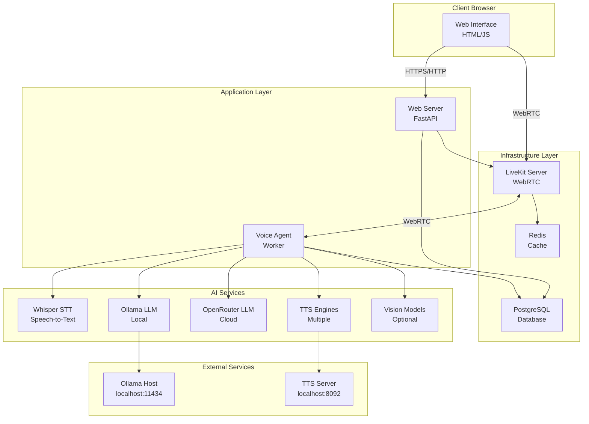
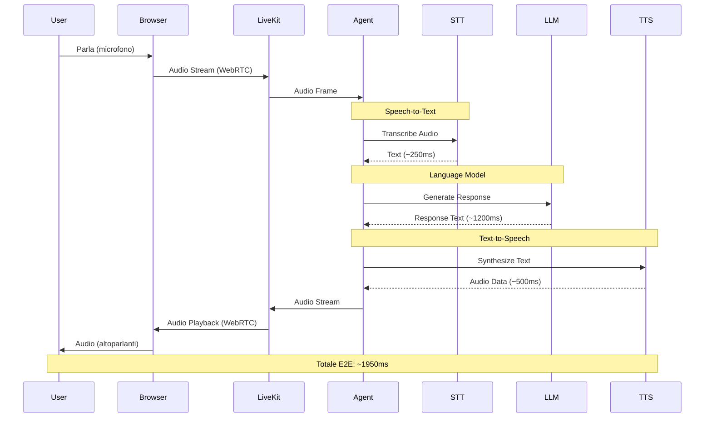
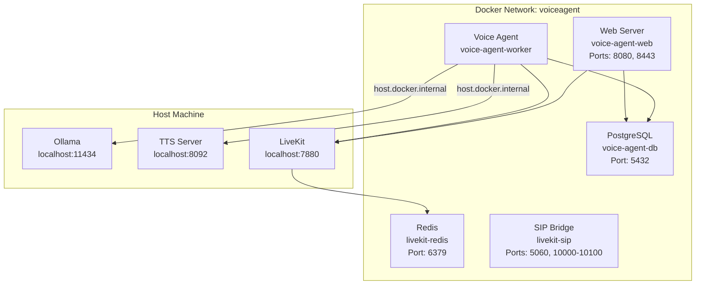
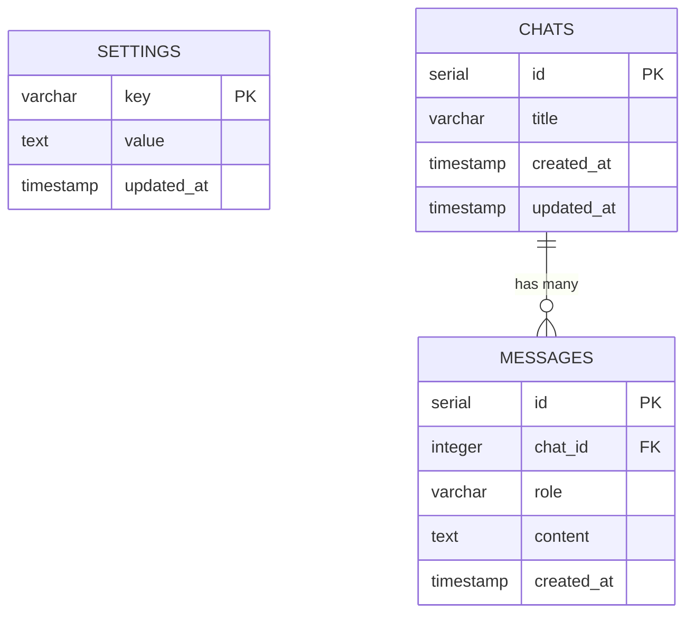
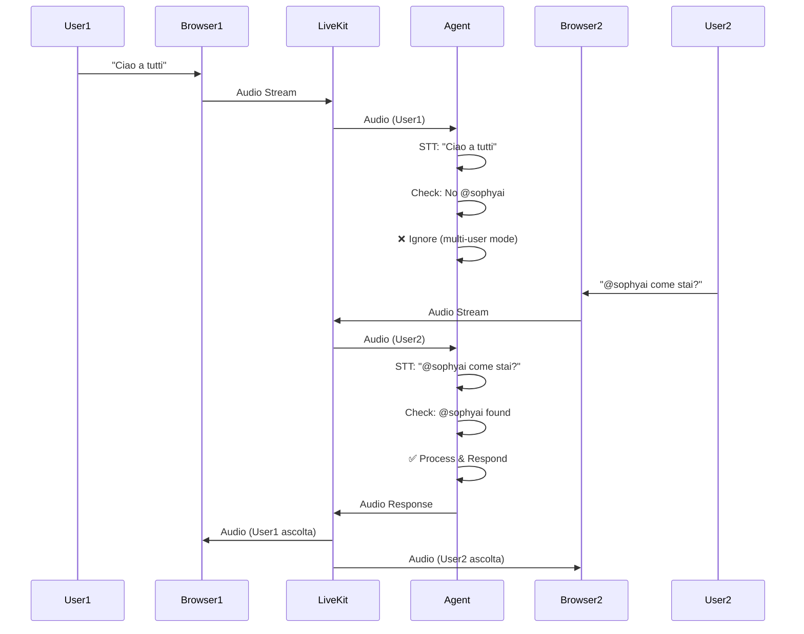
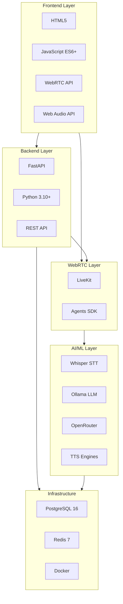
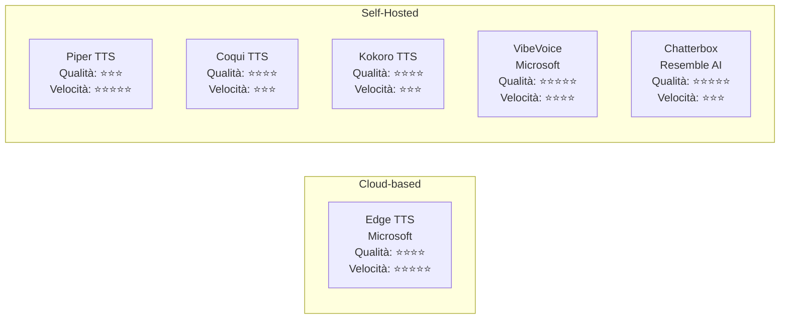

# Diagrammi Mermaid per la Presentazione

Questi diagrammi possono essere:
1. Visualizzati direttamente in Markdown viewers (GitHub, VS Code, ecc.)
2. Convertiti in PNG usando [Mermaid CLI](https://github.com/mermaid-js/mermaid-cli) o tool online
3. Copiati in PowerPoint come immagini

## 1. Architettura ad Alto Livello



## 2. Flusso End-to-End



## 3. Deployment Docker



## 4. Database Schema



## 5. Sequenza Multi-User



## 6. Stack Tecnologico



## 7. Confronto TTS Engines



## 8. Metriche Performance

```mermaid
gantt
    title Latenze End-to-End (CPU vs GPU)
    dateFormat X
    axisFormat %L ms
    
    section CPU (Small Model)
    STT           :0, 250
    LLM           :250, 1200
    TTS           :1450, 500
    Totale E2E    :0, 1950
    
    section GPU (Advanced)
    STT           :0, 150
    LLM           :150, 800
    TTS           :950, 300
    Totale E2E    :0, 1250
```



## Come Convertire in Immagini

### Opzione 1: Mermaid CLI

```bash
# Installa Mermaid CLI
npm install -g @mermaid-js/mermaid-cli

# Converti diagramma
mmdc -i grafici_mermaid.md -o grafici_presentazione/ -b transparent
```

### Opzione 2: Tool Online

1. Vai su https://mermaid.live
2. Incolla il codice Mermaid
3. Esporta come PNG/SVG

### Opzione 3: VS Code Extension

1. Installa extension "Markdown Preview Mermaid Support"
2. Apri questo file in VS Code
3. Usa "Export Diagram" dal menu contestuale

### Opzione 4: Python Script (matplotlib)

```bash
# Installa dipendenze
./installa_dipendenze_grafici.sh

# Genera grafici
python3 genera_grafici.py
```
